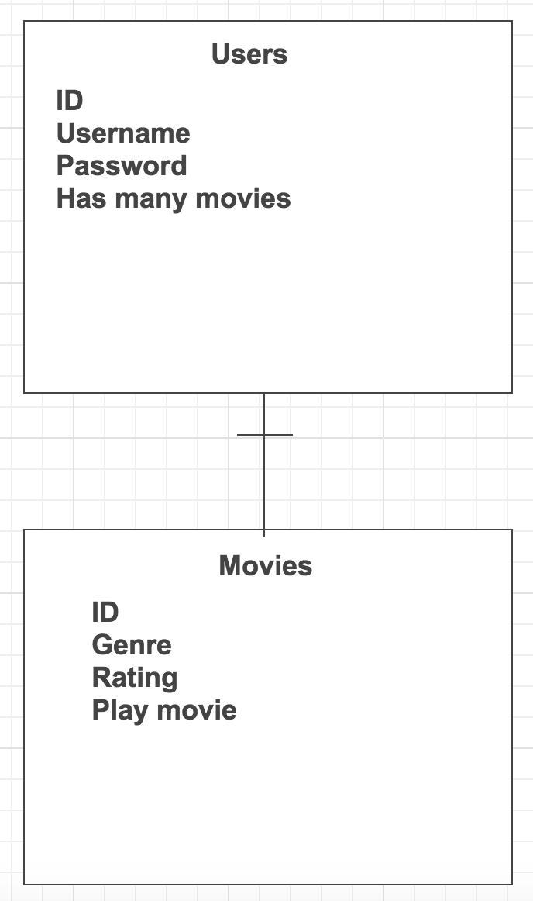

<H1>SIMON: Stream Internet Movies Online Now</H1>

MVP-stage - an app that lets you stream movies online for free!

    

<h1>TECHNOLOGY</h1>

Mongo, Express, Node.js

<strong>Needed:</strong>
<li>APIs: IMDB and Primwire</li>

<strong>Wishlist:</strong>
<li>like netflix to hover over and scroll through movies</li>
<li>search by genre or ratings</li>
<li>make a lot of money off of it and not get caught and go to jail or get fined a lot of money because i will blame it all on GA</li>

    

<h2>User Stories</h2>

User will have to log in first before they can access anything on the site.(so I can deploy it online and not go to jail, I will have accounts already made for our whole class)
Once the user logs there will be a display of popular movies already populated on the page that user may choose from, or user may search for a specific movie.

    

<h3> Wire Frame </h3>

